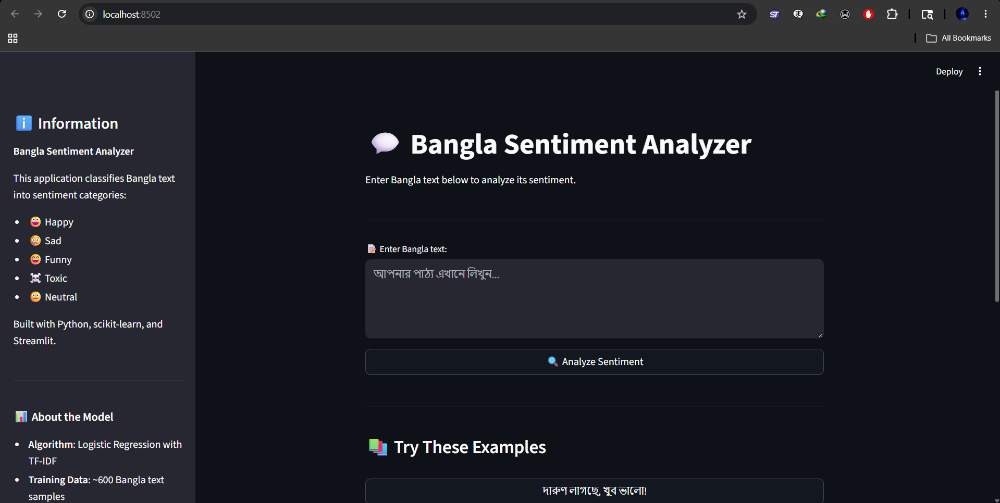
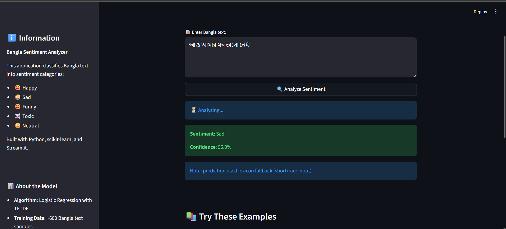
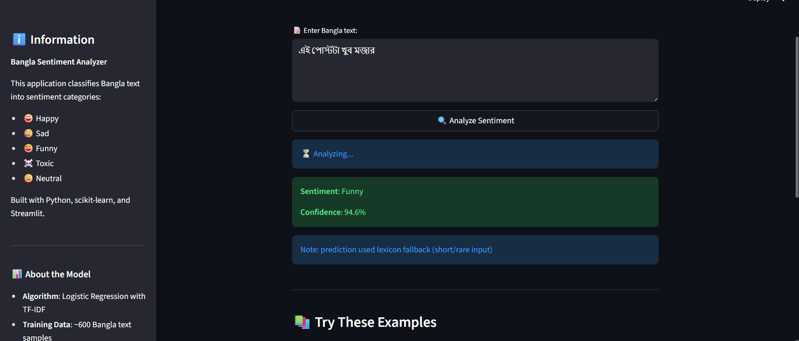
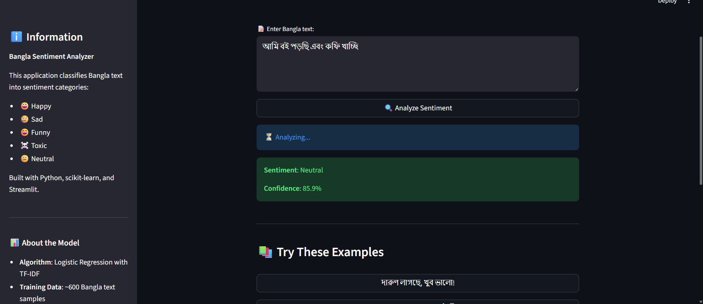

# Bangla Sentiment Analyzer

Lightweight Bangla sentiment classification demo. This repository contains preprocessing, a hybrid TF‑IDF + char n‑gram vectorizer, a Logistic Regression classifier, a lexicon fallback, and a Streamlit demo.

This README documents how to run the version currently in the repository (models are not committed — see "Model artifacts").

--

## Requirements
- Python 3.10+ (tested with Python 3.13)
- Install packages from `requirements.txt`:

```bash
python -m pip install -r requirements.txt
```

If you prefer a virtual environment:

```bash
python -m venv .venv
.venv\Scripts\activate   # Windows
python -m pip install -r requirements.txt
```

## Quick Start — Streamlit demo

1. Ensure `models/` contains trained artifacts: `best_model.joblib`, `vectorizer.joblib`, `label_encoder.joblib`.
   - These are NOT included in the repository. You can either run the retrain step below or place downloaded model files in `models/`.
2. Run the Streamlit app:

```bash
streamlit run app.py
```

Open the Local URL shown by Streamlit (default http://localhost:8501).

The app shows model status in the sidebar, a text box for input, example buttons, and a small notice when the lexicon fallback was used.

## Smoke tests and diagnostics

- Run a quick smoke prediction:

```bash
python -u src/smoke_test.py
```

- Audit lexicon usage and vectorizer coverage:

```bash
python -u src/fallback_audit.py
```

- Diagnostics to inspect features/probabilities for specific texts:

```bash
python -u src/diag_multi.py
python -u src/diag_predict.py
python -u src/inspect_coeffs.py
```

These scripts are intended for maintainers to reproduce debugging steps used during development.

## Retraining the model

The project includes a retrain script that builds a hybrid vectorizer (word + char TF‑IDF), optionally appends augmentation CSVs from `data/augments/`, trains several classifiers, selects the best, and writes artifacts to `models/`.

Run retraining with:

```bash
python src/retrain_hybrid_vectorizer.py
```

Notes:
- The training script saves `models/vectorizer.joblib`, `models/selector.joblib`, `models/best_model.joblib`, and `models/label_encoder.joblib` and writes `models/training_report_hybrid.txt`.
- The vectorizer parameters may be large (many features). Ensure your machine has sufficient RAM when using aggressive settings.

## Lexicon fallback behavior

The inference wrapper `src/prediction.py` implements a conservative lexicon fallback strategy:
- Exact-token overrides and a small set of negation rules (e.g., `ভালো নেই`) are used when appropriate.
- By default the model is preferred; the lexicon is applied only when the vectorizer yields no features (nnz==0) or the model's confidence is below a configurable threshold (0.65 by default).
- A small list of post-prediction sanity rules exist (e.g., prefer `Sad` when `খারাপ` is present and model predicted `Toxic`).

If you change lexicon or rules, update `data/lexicon.json` and run tests.

## Model details

- Targets: the system is trained to detect five sentiment classes (includes `Sad`, `Toxic`, `Neutral` and other sentiment labels used in the training data).
- Best model: Logistic Regression (selected as `best_model` by `src/retrain_hybrid_vectorizer.py`). A recent run reported a macro-F1 ≈ 0.846 on validation for the selected configuration.
- Confidence score: `src/prediction.py` returns a confidence value (probability or calibrated score derived from the model). The pipeline uses a default confidence threshold of `0.65` to decide whether the lexicon or post-prediction rules may override low-confidence model outputs. When the vectorizer produces zero features (nnz==0) the lexicon is used as a fallback.
- Evaluated models and modes: the retrain script trains and compares several classifiers (LogisticRegression, LinearSVC, MultinomialNB) and writes per-model evaluation metrics. Evaluation includes train/validation splits and cross-validation where applicable; the comprehensive per-run report is saved to `models/training_report_hybrid.txt`.
- Reproducing evaluation: run `python src/retrain_hybrid_vectorizer.py` and inspect `models/training_report_hybrid.txt`. Use `src/inspect_coeffs.py` to view top features driving specific labels.

## Project status

This project is experimental and unfinished. It contains a working inference pipeline and a Streamlit demo, but several areas need more work before production use, including:

- Expanded and curated lexicon pruning.
- More robust unit and integration tests for rules and edge cases.
- Careful evaluation of char n‑gram impacts and targeted augmentation.
- Packaging and an automated release workflow for model artifacts.

Contributions, issue reports, and pull requests are welcome — please treat the repository as a research/demo codebase.

## Screenshots




*App home / status panel*



*Prediction panel showing example inference*



*Alternative view with examples*



*Compact mobile/responsive layout*


## Tests

Run unit tests (if present):

```bash
pytest -q
```

## Contribution notes
- Add new augment CSVs to `data/augments/` (columns: `Comment,Sentiment`) to include them in retraining.
- Keep lexicon entries conservative; prefer model predictions where confident.
- When adjusting vectorizer size, run the audit scripts to monitor lexicon fallback rate and nnz coverage.

## Contact / Credits
This project was developed as a lightweight research/demo for Bangla sentiment classification. For questions, open an issue in the repository.
